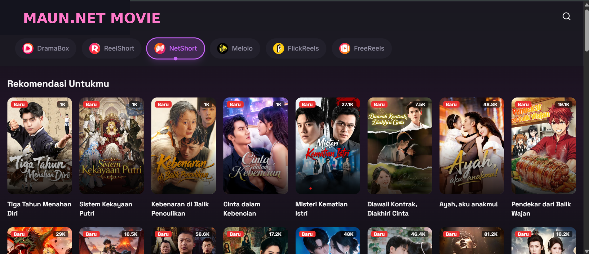

# SekaiDrama

[](https://github.com/Sansekai/SekaiDrama/blob/main/LICENSE)
[](https://github.com/Sansekai/SekaiDrama)



SekaiDrama adalah platform streaming drama pendek (vertical drama) modern yang menampilkan konten dari bebebrapa platform populer. Dibangun dengan teknologi web terkini untuk performa maksimal dan pengalaman pengguna yang premium.

## Persyaratan Sistem
Sebelum memulai, pastikan komputer Anda sudah terinstall:
- [Node.js](https://nodejs.org/) (Versi 18 LTS atau 20 LTS disarankan)
- Git (Opsional)

## Panduan Instalasi (Localhost)

Ikuti langkah-langkah berikut untuk menjalankan project ini di komputer Anda:

### 1. Clone Repository
1.  Buka terminal (Command Prompt/PowerShell).
2.  Clone repository ini ke komputer Anda:
    ```bash
    git clone https://github.com/Sansekai/SekaiDrama.git
    ```
3.  Masuk ke folder project:
    ```bash
    cd SekaiDrama
    ```

### 2. Install Dependencies
Install semua library yang dibutuhkan project ini:
```bash
npm install
# atau jika menggunakan yarn
yarn install
# atau pnpm
pnpm install
```

### 3. Konfigurasi Environment Variable
Salin file bernama `.env.example` menjadi `.env`

### 4. Jalankan Development Server
Mulai server lokal untuk pengembangan:
```bash
npm run dev
```

Buka browser dan kunjungi [http://localhost:3000](http://localhost:3000).

## Script Perintah
| Command | Fungsi |
|---------|--------|
| `npm run dev` | Menjalankan server development |
| `npm run build` | Membuat build production |
| `npm run start` | Menjalankan build production |
| `npm run lint` | Cek error coding style (Linting) |

## Struktur Folder
```text
src/
├── app/                    # Halaman & Routing (Next.js App Router)
│   ├── (auth)/             # Route Group untuk fitur Login/Register
│   ├── (main)/             # Route Group untuk konten utama (Home, Search)
│   ├── api/                # API Routes untuk integrasi backend
│   ├── drama/              # Halaman detail & Video player
│   └── layout.tsx          # Root layout aplikasi
├── components/             # Reusable UI Components
│   ├── ui/                 # Base components (Shadcn UI)
│   ├── player/             # Komponen khusus video player
│   ├── cards/              # Komponen card drama/koleksi
│   └── layouts/            # Navbar, Sidebar, Footer
├── hooks/                  # Custom React Hooks (useAuth, usePlayer, dll)
├── lib/                    # Helper functions & konfigurasi library (Prisma, Axios)
├── services/               # Logic fetching data & business logic
├── types/                  # TypeScript interfaces & types definitions
└── styles/                 # Global CSS & Tailwind configuration
```
